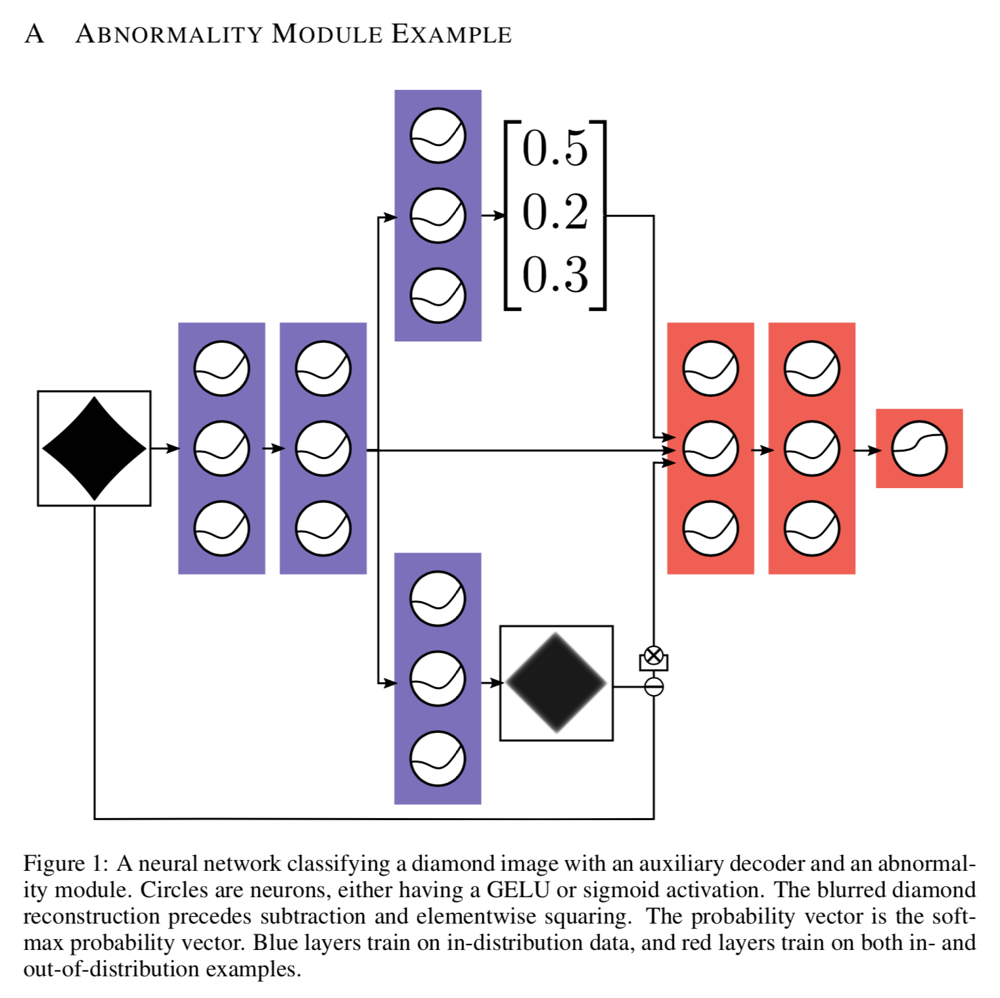
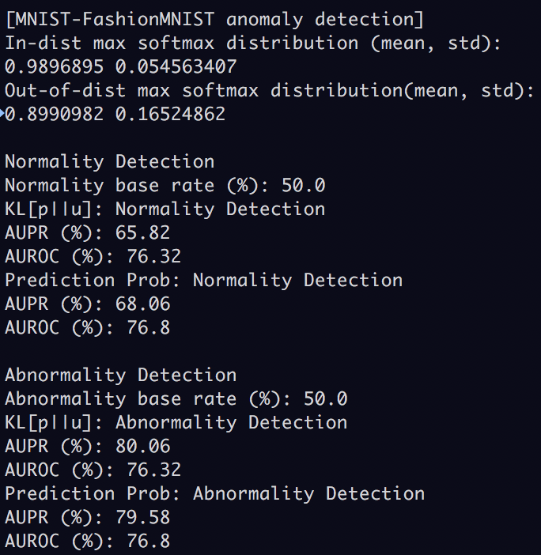

## Overview

This repository contains reproduced vision experiments in  
_'A Baseline for Detecting Misclassified and Out-of-Distribution Examples in Neural Networks'_,  
by Hendrycks et al. It uses Tensorflow Keras API to build model blocks.

To see references(Papers, original code), please check below resources.  
I tried to keep the code simple but they may still nasty enough to confuse you(sorry).  
Any suggestions or corrections are welcome.

### Abnormality module for anomaly detection

  

The paper suggests utilizing Anomality module to enhance overall performance.

### Version range, Dependencies

-   python>=3.4
-   tensorflow>=1.8
-   numpy
-   scikit-learn
-   h5py (for saving/loading Keras model)
-   jupyter (optional)

### Usage

```bash
python3 01.mnist_softmax.py # Pure softmax detector
python3 02.mnist_abnormality_module.py # Anomaly detector with auxiliary decoder
```

### Todo:

-   Apply moving average to trained parameters, using tf.train.ExponentialMovingAverage()
-   Gelu Nonlinearity
-   AUROC, AUPR Visualization web page(hopefully)

### Resources:

-   [https://arxiv.org/abs/1610.02136](https://arxiv.org/abs/1610.02136)
-   [https://github.com/hendrycks/error-detection](https://github.com/hendrycks/error-detection) (Original repository)


